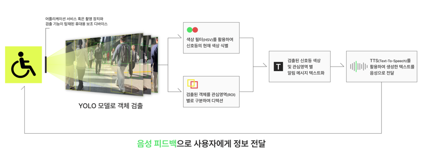

# 보행약자 통행 보조 시스템 개발 프로젝트
- 기간 : 2024.10.21 ~ 2024.11.18
- 인원 : 5명
- 역할 : 팀장, 데이터 수집/라벨링, 웹페이지 설계/구축
- 기술 : Python, numpy, Jupyter, corab, pytorch, YOLO, OpenCV, FFmpeg

## 프로젝트 개요
점자블록 훼손 및 음향 신호기 미설치 등 시각장애인을 포함한 보행약자의 안전을 위협하는 장애 요소가 보행로에 산재해 있습니다. 기존의 공공 보조 수단만으로는 개별 보행 약자의 실시간 돌발 상황을 대처하기 어렵다는 한계가 존재합니다.
본 프로젝트에서는 AI-Hub의 인도 보행 데이터셋과 웹 크롤링으로 수집한 커스텀 데이터를 활용하여 실시간 위험 객체를 감지하는 딥러닝 기반 시스템을 개발하였습니다.
YOLOv8 Nano 모델을 기반으로 도로 위 장애물을 신속하게 탐지하고 관심영역(ROI) 분석 및 음성 안내(TTS) 기술을 결합하여, 보행약자의 시야를 보완하고 안전한 이동의 자유를 보장하는 개인화된 스마트 보조 솔루션 구현을 목표로 합니다.

## 프로젝트 목표
- **실시간 경량 객체 탐지 모델 구축:** 동영상 데이터의 실시간 추론 속도와 사용자 피드백 속도를 고려하여 최적의 초경량 모델인 YOLOv8 Nano 기반 커스텀 데이터 학습 진행
- **컴퓨터 비전 기술 활용 신호등 상태 구분:** 신호등 형태를 인식한 바운딩 박스 내에서 HSV 색상 필터를 적용해 보행 신호(초록불)와 대기 신호(빨간불)를 실시간으로 정밀 식별
- **관심영역(ROI) 기반 위험도 차등 검출:** 사용자 시점 기준의 관심영역(ROI) 마스크를 설정하고, 장애물의 근접도 및 이동 순서에 따라 탐지 우선순위를 시각적으로 차별화
- **TTS 기반 실시간 정보 음성 전달 안내:** 탐지된 객체의 종류와 위치(방향, 거리) 정보를 즉각적으로 텍스트화한 후 TTS(Text-To-Speech) 기술을 적용하여 사전에 위험을 인지할 수 있는 음성 안내 피드백 구현

## 데이터 출처
AI-Hub의 인도보행 영상 데이터셋에서 제한된 시간과 자원을 고려해 일부 데이터를 선별하였고, 추가적으로 구현하고 싶은 기술에 필요한 객체 이미지 데이터를 웹크롤링 및 데이터 라벨링 작업을 통해 데이터 준비.

## 설계 및 구현

## 구현 영상
- 📹 [횡단보도에서 구현한 영상](https://youtu.be/2TFjuYEXA8k)
- 📹 [낮에 구현한 영상](https://youtu.be/3AaGT7UPsJI)
- 📹 [밤에 구현한 영상](https://youtu.be/LuUxrY0pYWQ)
- 📹 [킥보드가 지나갈 때 구현한 영상](https://youtu.be/BO_NCWcO8lA)
- 📹 [웹페이지 시연 영상](https://youtu.be/Ey9p081Ahag)

## 한계 및 보완점
- 음성의 길이와 속도를 고려해서 최적의 인지를 위한 음성 전달 시점을 파악해야 하고, 사용자의 주변 상황을 담는 카메라의 광각과 관심 영역 면적의 면밀한 조정 문제 존재함. 2D 화면 상의 원근감, 거리감 등의 표현 한계로 사용자의 입장을 고려한 디테일한 영역 조정이 필요.
- 야간 환경 및 비, 눈 등 여러 기상 상태에 따라 탐지 정확도 저하 문제가 있을 수 있음.
- 모델의 검출 성능이 동영상 처리 시 실시간으로 안정적인 결과를 제공하는 데 한계가 있음. 높은 처리 속도 요구와 함께 정확한 객체 탐지를 하는 과정에서 실시간으로 장애물을 검출하는 처리 속도와 사용자 안전을 위한 높은 정확도 간의 균형을 맞추는 데 어려움이 있었음.
- 데이터 수집 및 기능 구현 과정에서 차량 번호판이나 개인의 얼굴 등 민감한 정보를 수집 및 활용하는 사생활 보호 이슈가 있을 수 있음.
- 향후 실시간 검출을 위해 사용자의 안전을 위한 높은 정확도와 서비스 최적화 간 차이를 줄이기 위해 적절한 데이터 선별과 사용자의 피드백을 반영한 추가 데이터 학습으로 모델의 성능을 점진적으로 보완.

## 결론
객체 인식과 음성 알림 기술을 활용한 개인화된 보조 장치는 보행 약자의 시야를 보완하고, 위험 요소를 사전에 경고하여 이동의 자유를 증대시키고 사고를 예방할 수 있으며, 궁극적으로 누구나 평등한 보행 환경을 누릴 수 있도록 기여할 것.
